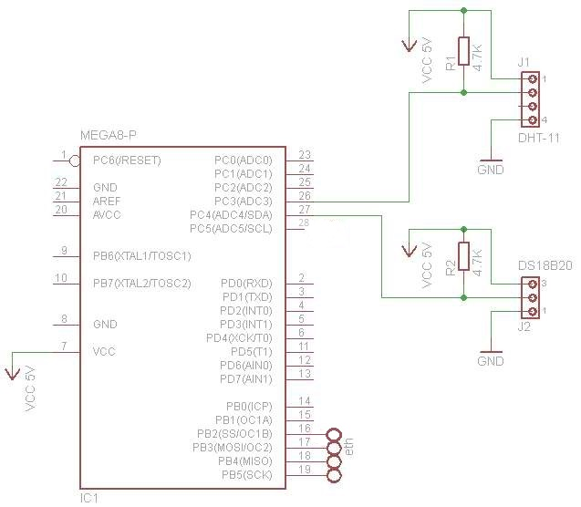
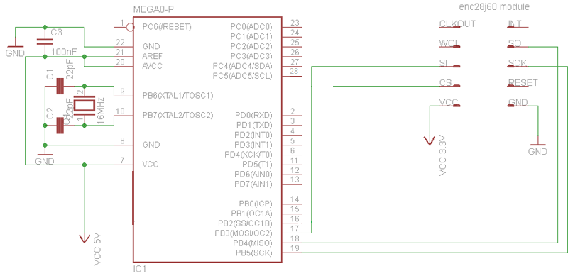
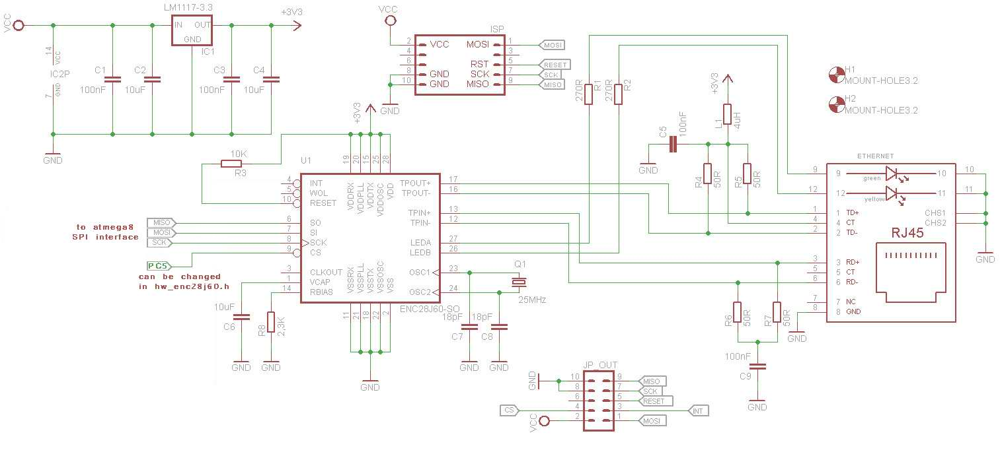

# ATMEGA8-Temperature-Humidity-Ethernet

a simple project with ATMEGA8,DS18B20 temoerature sensor,DHT11 humidity and temperature sensor,ENC28J60 stand alone Ethernet Controller

# Refrences

[DS18B20 and DHT11](http://www.pocketmagic.net/atmega8-temperature-sensors-ds18b20-and-dht11/ "DS18B20 and DHT11")

[UDP Client](http://www.pocketmagic.net/atmega8-udp-client/ "UDP Client")

[enc28j60](http://www.pocketmagic.net/atmega8-and-enc28j60-for-ethernet-support/ "enc28j60")

[fuse-bits-oscillator-settings](http://www.scienceprog.com/programming-avr-fuse-bits-oscillator-settings/ "fuse-bits-oscillator-settings")

[echotool](http://bansky.net/echotool/ "echotool")

[انتقال داده از طریق اترنت با ENC28J60 ](http://electronics98.com/%D9%BE%D8%B1%D9%88%DA%98%D9%87-%D9%87%D8%A7%DB%8C-%D9%85%DB%8C%DA%A9%D8%B1%D9%88%DA%A9%D9%86%D8%AA%D8%B1%D9%84%D8%B1/%D8%A7%D9%86%D8%AA%D9%82%D8%A7%D9%84-%D8%AF%D8%A7%D8%AF%D9%87-%D8%A7%D8%AA%D8%B1%D9%86%D8%AA-enc28j60-%D9%85%DB%8C%DA%A9%D8%B1%D9%88%DA%A9%D9%86%D8%AA%D8%B1%D9%84%D8%B1-avr/ "انتقال داده از طریق اترنت با ENC28J60 ")
